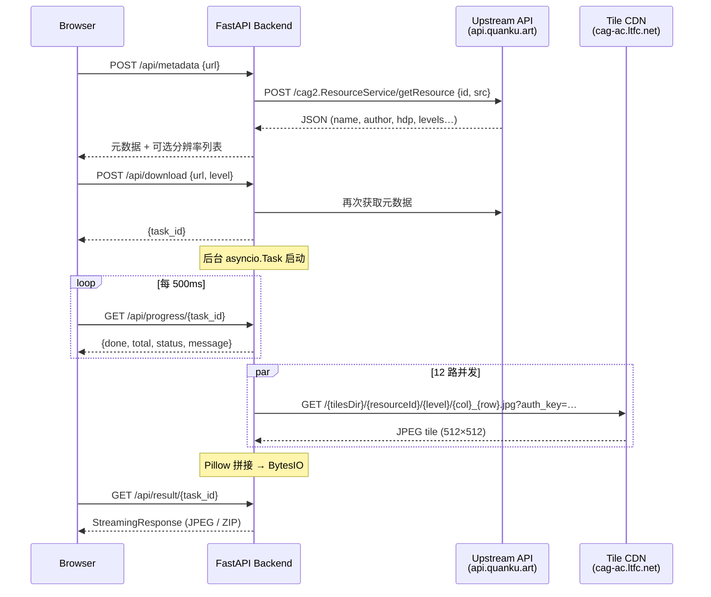
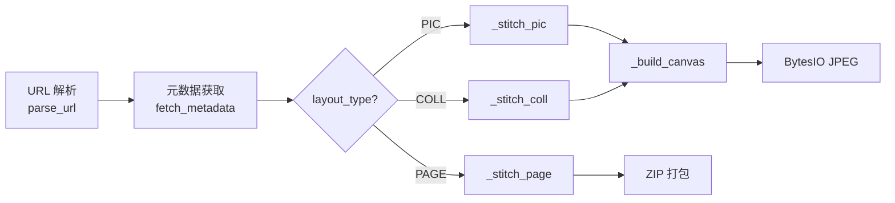
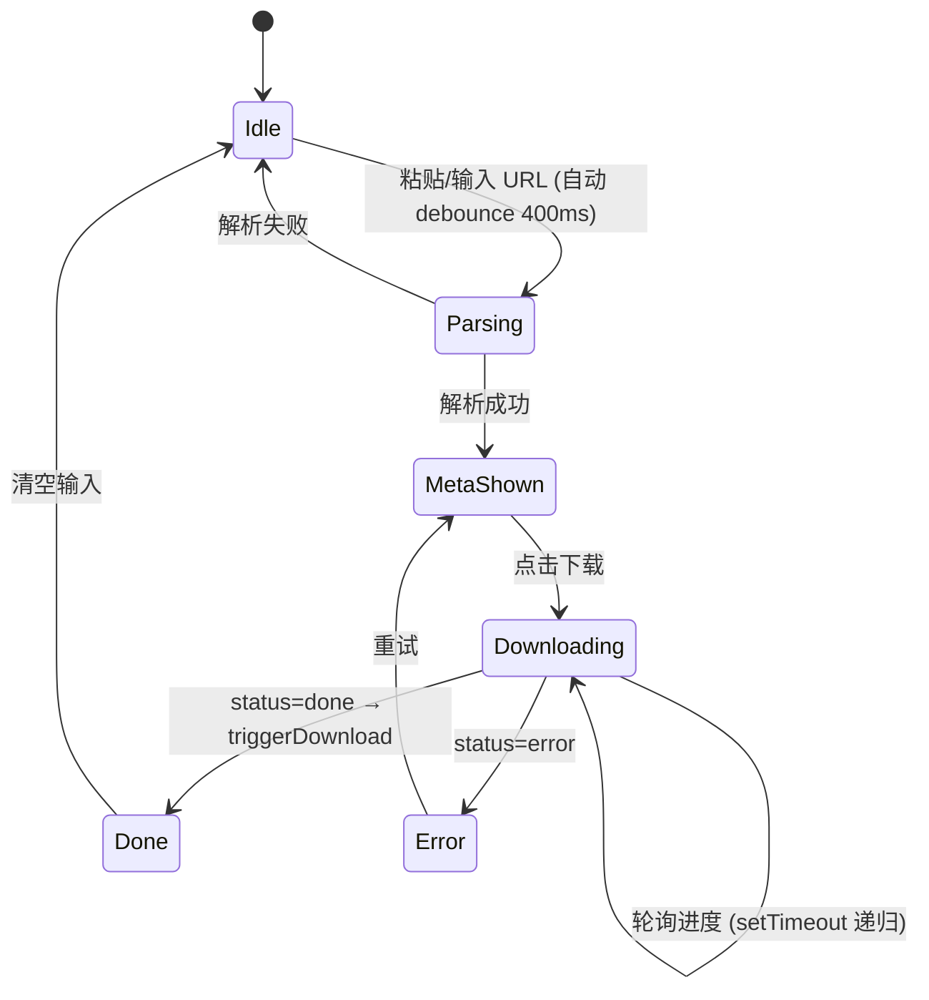

# 技术架构文档

## 1. 系统全景



## 2. 目录结构

```
treasure-fetch/
├── backend/
│   ├── __init__.py
│   ├── app.py              # FastAPI 路由层
│   └── tile_service.py     # 核心下载拼接逻辑（无框架依赖）
├── frontend/
│   └── index.html          # 单文件 SPA（HTML + CSS + JS）
├── requirements.txt
├── README.md
└── ARCHITECTURE.md          # ← 本文件
```

## 3. 核心模块：tile_service.py

### 3.1 职责链



### 3.2 数据模型

| 类 | 职责 | 关键字段 |
|---|---|---|
| `ArtworkMeta` | 作品元数据 | `id`, `layout_type`, `name`, `author`, `width`, `height`, `min_level`, `max_level`, `resource_id`, `pieces` |
| `PieceMeta` | COLL/PAGE 中单个分片 | `resource_id`, `tiles_dir`, `width`, `height`, `min_level`, `max_level`, `canvas_x`, `canvas_y` |
| `DownloadProgress` | 下载状态追踪 | `total`, `done`, `status`, `message` |

### 3.3 三种布局处理差异

| 特性 | PIC | COLL (TILE) | PAGE |
|------|-----|-------------|------|
| 数据源 | `hdp.hdpic` | `hdp.hdpcoll.hdps[]` + `tileLayout.tiles[]` | `hdp.hdpcoll.hdps[]` (layoutMode=PAGE) |
| 级别范围 | 单图的 min/max | 所有分片交集 | 所有页并集（各页独立 clamp） |
| 拼接方式 | 单画布直接贴 | 各分片贴入统一画布 (canvas_x/y 定位) | 各页独立拼接 |
| 输出格式 | JPEG | JPEG | ZIP (内含多个 JPEG) |
| 容错 | 单块 404 留白 | 单块 404 留白 | 整页无可用块则跳过该页 |

## 4. CDN 鉴权机制

使用阿里云 CDN Type-A 签名方案：

```
签名 = MD5("{path}-{timestamp}-0-0-{secret_key}")
URL  = https://cag-ac.ltfc.net{path}?auth_key={timestamp}-0-0-{签名}
```

| 参数 | 值 |
|------|-----|
| `path` | `/{tilesDir}/{resourceId}/{level}/{col}_{row}.jpg` |
| `timestamp` | 当前 Unix 秒 |
| `secret_key` | 硬编码密钥 |

瓦片固定 512×512 像素，JPEG 格式。

## 5. 缩放级别与瓦片数

每降一个 level，宽高各减半，瓦片数约减为 1/4：

```
Level 18:  7093 × 10879  →  ~300 tiles
Level 17:  3547 × 5440   →  ~77 tiles
Level 16:  1774 × 2720   →  ~21 tiles
Level 15:   887 × 1360   →  ~6 tiles
```

`available_levels` 属性动态计算每个级别的像素尺寸和瓦片数，供前端展示选择。

## 6. 并发控制

```python
sem = asyncio.Semaphore(12)   # 最大 12 路同时下载
httpx.AsyncClient(timeout=30) # 单请求 30s 超时
```

所有图块通过 `asyncio.gather` 并发调度，信号量限流防止 CDN 限速。

## 7. 前端交互流



关键 UX 细节：
- **自动解析**：`input` 事件 + 正则检测有效 URL → 自动调用 `/api/metadata`
- **默认最高清**：分辨率下拉默认选中最后一项（最高 level）
- **防重复下载**：轮询使用递归 `setTimeout` + `pollStopped` 标志，避免 `setInterval` + `async/await` 竞态
- **PAGE 感知**：按钮文案自动切换为"下载全部（N 页 ZIP）"，文件后缀 `.zip`

## 8. 失败处理矩阵

| 场景 | 处理方式 |
|------|---------|
| URL 格式无效 | 400 + 前端红色提示 |
| 上游 API 超时/错误 | 502 + 错误信息透传 |
| 单个 tile 404 | 静默返回 `b""`，该位置留白 |
| 单个 tile 网络错误 | 同上 |
| PAGE 整页所有 tile 失败 | 跳过该页，ZIP 中不包含 |
| 下载任务异常 | `progress.status = "error"`，前端展示 message |
| 任务 ID 不存在 | 404 |
| 结果未就绪时拉取 | 409 |

## 9. 已知局限与演进方向

| 项目 | 现状 | 演进 |
|------|------|------|
| 任务存储 | 内存 dict | Redis + Celery |
| 鉴权 | 无 | API Key / OAuth |
| 缓存 | 无 | 元数据缓存 + 图块缓存（本地 / S3） |
| 部署 | 单进程 | Docker + Gunicorn workers |
| 监控 | 无 | Prometheus metrics + 结构化日志 |
